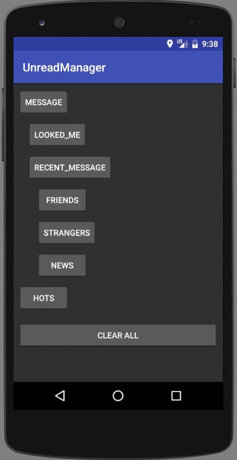

UnreadManager
---

UnreadManager是一个未读消息管理系统，用于在软件中管理添加未读消息的角标。原理是通过SharedPreferences存储未读的消息条数，然后通过该管理类将其展示到界面的角标上。

在使用的时候定义自己的角标层级关系，在修改子级角标的时候，遍历与其级联的父级角标进行修改。所以我们只需要关心无子集的最小元素，并设置其父集即可。

完全由本地维护。在拿到服务器未读消息数更新的时候，本地清除相关类型的存储内容并重新赋值存储内容。

后续再优化里面那个`BadgeView`吧。

## Use
1. 设置层级关系：见[Constant.java](./app/src/main/java/com/zrp/unreadmanager/Constant.java)，其中`LOOKED_ME`、`FRIENDS`、`STRANGERS`、`NEWS`均未无子集且有父集的最小元素，需要配置其`parentMap`；其中`HOTS`为无父级的最小元素，所以不需要添加其父级关系。
1. 进行未读初始化，以用户id等作为storeTag。如果进行了用户的切换，在切换完成之后重新调用该初始化：`UnreadMgr.getInstance().init(this, "user", Constant.parentMap);`
1. 初始化并注册`BadgeView`：见[MainActivity.java#onResume](./app/src/main/java/com/zrp/unreadmanager/MainActivity.java)
1. 主动添加存储角标
    - 添加数字角标：`UnreadMgr.getInstance().addNumUnread(Constant.LOOKED_ME);`
    - 添加文字角标：`UnreadMgr.getInstance().addStringUnread(Constant.NEWS, "Hot news!");`



技术渣，欢迎PR和ISSUES。

## Licences
```
Copyright 2016 sanchi3

Licensed under the Apache License, Version 2.0 (the "License");
you may not use this file except in compliance with the License.
You may obtain a copy of the License at

http://www.apache.org/licenses/LICENSE-2.0

Unless required by applicable law or agreed to in writing, software
distributed under the License is distributed on an "AS IS" BASIS,
WITHOUT WARRANTIES OR CONDITIONS OF ANY KIND, either express or implied.
See the License for the specific language governing permissions and
limitations under the License.
```
